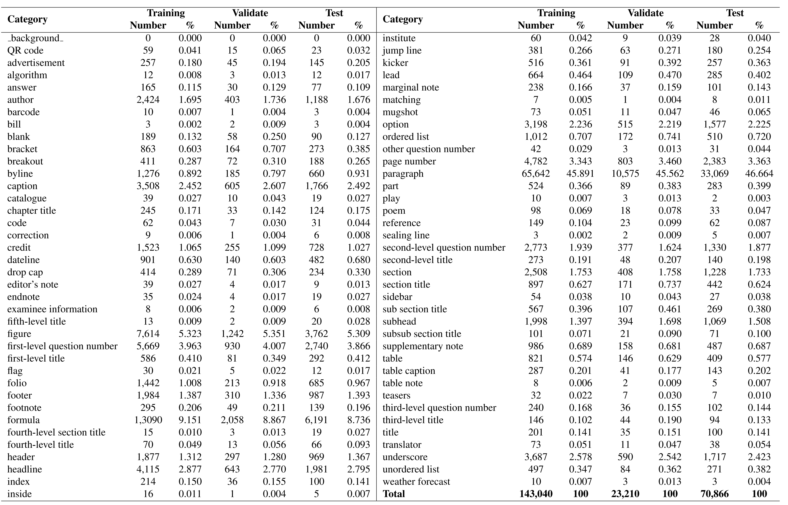

# M<sup>6</sup>Doc_Dataset_Release
The [M<sup>6</sup>Doc](https://openaccess.thecvf.com/content/CVPR2023/html/Cheng_M6Doc_A_Large-Scale_Multi-Format_Multi-Type_Multi-Layout_Multi-Language_Multi-Annotation_Category_Dataset_CVPR_2023_paper.html) dataset for the research of document layout analysis in Modern Document is now released by the Deep Learning and Visual Computing Lab of South China University of Technology. The test dataset can be downloaded through the following link:
- [Baidu Cloud](https://pan.baidu.com/s/1O0k4zo6e_pnUebwEPXu0Fg?pwd=dlvc)(Size=3.75G)
- [OneDrive](https://1drv.ms/u/s!AuZg70Qbn4fEiVGjzKiExS5P65rV?e=EOIxKe)

Note: The M<sup>6</sup>Doc dataset can only be used for non-commercial research purposes. For scholars or organizations who want to use the M<sup>6</sup>Doc database, please first fill in this [Application Form](Application_Form/Application-Form-for-Using-M6Doc.docx) and send it via email to us ([lianwen.jin@gmail.com](mailto:lianwen.jin@gmail.com) or [eelwjin@scut.edu.cn](mailto:eelwjin@scut.edu.cn)). When submitting the application form to us, please list or attach 1-2 of your publications in the recent 6 years to indicate that you (or your team) do research in the related research fields of OCR, handwriting analysis and recognition, document image processing, or visual information extraction. At present, this dataset is only freely available to scholars in the above-mentioned fields. **We will give you the download links and decompression passwords for the training dataset and validation dataset after your letter has been received and approved**.

## License
The M<sup>6</sup>Doc dataset should be used and distributed under the [Creative Attribution-NonCommercial-NoDerivatives 4.0 International (CC BY-NC-ND 4.0) License](https://creativecommons.org/licenses/by-nc-nd/4.0/) for non-commercial research purposes.

## M<sup>6</sup>Doc Dataset
The M<sup>6</sup>Doc dataset contains a total of 9,080 modern document images, which are categorized into seven subsets, *i.e.*, scientific article (11\%), textbook (23\%), test paper (22\%), magazine (22\%), newspaper (11\%), note (5.5\%), and book (5.5\%) according to their content and layouts. It contains three formats: PDF (64\%), photographed documents (5\%), and scanned documents (31\%). The dataset includes a total of 237,116 annotated instances. 

## Dataset Source
The M<sup>6</sup>Doc datasets were collected from various sources, including [arXiv](https://arxiv.org/), the official website of the [Chinese People's Daily](http://paper.people.com.cn/), and [VKontakte](https://vk.com/). The source and composition of different subsets are shown below.

  * The scientific article subset includes articles obtained by searching with the keywords \"Optical Character Recognition\" and \"Document Layout Analysis\" on arXiv. PDF files were then downloaded and converted to images.
  * The textbook subset contains 2,080 scanned document images from textbooks for three grades (elementary, middle, and high school) and nine subjects (Chinese, Math, English, Physics, Chemistry, Biology, History, Geography, and Politics).
  * The test paper subset consists of 2,000 examination papers covering the same nine subjects as the textbook subset.
  * The magazine subset includes 1,000 Chinese and English magazines in PDF format, respectively. The Chinese magazines were sourced from five publishers: Global Science, The Mystery, Youth Digest, China National Geographic, and The Reader. The English magazines were sourced from five American publishers: The New Yorker, New Scientist, Scientific American, The Economist, and Time USA.
  * The newspaper subset contains 500 PDF document images from the Chinese People's Daily and the Wall Street Journal.
  * The note subset consists of students' handwritten notes in nine subjects, including 500 scanned pages.
  * The book subset contains 500 photographed images, which were acquired from 50 books with 10 pages each. Each book has a distinct layout, resulting in considerable diversity in this subset.


## Data Annotation
### Label definition
To ensure that the definition of document layout elements is reasonable and traceable, we reviewed relevant information, such as layout knowledge and layout design. We also used knowledge from the book \"Page Design: New Layout \& Editorial Design(2019)\" and referred to YouTube video explanations regarding [magazine](https://www.youtube.com/watch?v=7sSJtScnsjE) and [newspaper](https://www.youtube.com/watch?v=LcsOuGcaqZs) layouts. In most cases, we followed the [Wikipedia](https://www.wikipedia.org) definition. Consequently, we defined 74 detailed document annotation labels. The key factors in selecting these annotation labels include (1) the commonality of annotation labels between different document types, (2) the specificity of labels between different document types, (3) the frequency of labels, and (4) the recognition of independent pages. We first unified the labels between different documents to the maximum extent and then defined the labels for certain document types for differentials. Commonality and specificity ensure that the defined labels can adapt to multiple document types, which implies that a more detailed logical layout analysis for a certain type of document can be performed. It differs from how labels are defined in DocBank, PubLayNet, and DocLayNet, which all ignore defining specific labels for different document types. Figure 1 shows annotation samples of M<sup>6</sup>Doc. There are a total of 74 annotation categories in our dataset.


<p align="center">Figure 1. Example annotations of the M<sup>6</sup>Doc. Zoom in for better view.</p>

For a fair evaluation, we divided the dataset into training, validation, and test sets in a ratio of 6:1:3. We also ensured that the different labels were in equal proportions in the three sets. Table 2 summarizes the overall frequency and distribution of labels in different sets.

<p align="center">Table 2. M<sup>6</sup>Doc dataset overview.</p>



### Annotation guideline
We provide a detailed annotation guideline([guideline_chinese](guideline/guideline_chinese.pdf) (over 170 pages) and some typical annotation examples. 47 annotators performed the annotation task strictly according to the guidelines.

## Directory Format
The dataset is organized in the following directory format:
```
├── M6Doc
    ├── annotations
    │   ├── instances_train2017.json
    │   │── instances_val2017.json
    │   └── instances_test.json
    ├── train2017
    │   ├── xxx.jpg
    │   └── ...
    ├── val2017
    │   ├── xxx.jpg
    │   └── ...
    └── test2017
        ├── xxx.jpg
        └── ...

```

## Citation and Contact
Please consider to cite our paper when you use our dataset:
```
@InProceedings{Cheng_2023_CVPR,
    author    = {Cheng, Hiuyi and Zhang, Peirong and Wu, Sihang and Zhang, Jiaxin and Zhu, Qiyuan and Xie, Zecheng and Li, Jing and Ding, Kai and Jin, Lianwen},
    title     = {M6Doc: A Large-Scale Multi-Format, Multi-Type, Multi-Layout, Multi-Language, Multi-Annotation Category Dataset for Modern Document Layout Analysis},
    booktitle = {Proceedings of the IEEE/CVF Conference on Computer Vision and Pattern Recognition (CVPR)},
    month     = {June},
    year      = {2023},
    pages     = {15138-15147}
}
```

For any questions about the dataset, please contact the authors by sending an email to Prof. Jin([eelwjin@scut.edu.cn](mailto:eelwjin@scut.edu.cn), or [lianwen.jin@gmail.com](mailto:lianwen.jin@gmail.com)). 
