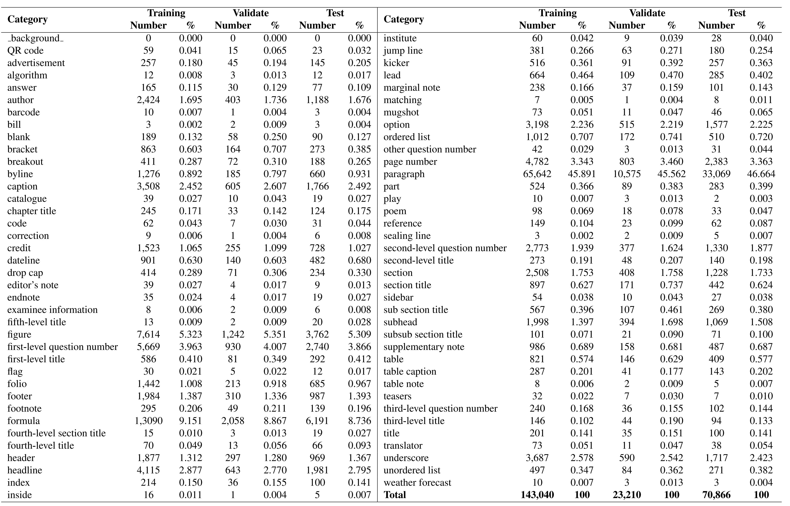

# M<sup>6</sup>Doc 数据集公开发布

<p align="center">
    <a href="https://openaccess.thecvf.com/content/CVPR2023/papers/Cheng_M6Doc_A_Large-Scale_Multi-Format_Multi-Type_Multi-Layout_Multi-Language_Multi-Annotation_Category_Dataset_CVPR_2023_paper.pdf"></a>
    <a href="https://huggingface.co/datasets/hiuyi/M6Doc"></a>
    <a href="README.md"></a>
</p>

[M<sup>6</sup>Doc](https://openaccess.thecvf.com/content/CVPR2023/html/Cheng_M6Doc_A_Large-Scale_Multi-Format_Multi-Type_Multi-Layout_Multi-Language_Multi-Annotation_Category_Dataset_CVPR_2023_paper.html) 是由华南理工大学深度学习与视觉计算实验室（SCUT DLVC Lab）发布的现代文档版面分析基准数据集。

---

## 数据集下载

| 托管平台 | 下载链接 | 文件名称与大小 | 是否需要解压密码 |
| :--- | :--- | :--- | :---: |
| **Hugging Face** | [🤗 hiuyi/M6Doc 仓库入口](https://huggingface.co/datasets/hiuyi/M6Doc) | `M6Doc.zip` | **是**（加密归档） |
| **百度网盘** | [点击跳转百度网盘下载](https://pan.baidu.com/s/1jV9WTE9yVZfwWF_x1JZE9Q?pwd=xx3k) | 12.45 GB（提取码：`xx3k`） | **是**（加密归档） |

### 从 Hugging Face 下载数据的方式

您可以通过以下任意一种方式下载 `M6Doc.zip`：

**方式一：网页端直接下载**
- 访问仓库文件列表页面：[hiuyi/M6Doc / Files and versions](https://huggingface.co/datasets/hiuyi/M6Doc/tree/main)，找到 `M6Doc.zip` 并点击下载按钮。

**方式二：通过 Python 脚本下载 (`huggingface_hub`)**
```python
from huggingface_hub import hf_hub_download

hf_hub_download(
    repo_id="hiuyi/M6Doc",
    filename="M6Doc.zip",
    repo_type="dataset",
    local_dir="./"
)
```

**方式三：通过 Hugging Face 命令行（CLI）**
```bash
huggingface-cli download --repo-type dataset hiuyi/M6Doc M6Doc.zip --local-dir ./
```

---

## ⚠️ 访问权限与申请流程

M<sup>6</sup>Doc 数据集**仅限用于非商业学术研究目的**。数据现已公开下载，但**压缩包使用提取码加密保护**。申请解压密码的具体步骤如下：

### 第一步：下载并填写协议文档
- 📄 [M<sup>6</sup>Doc 使用申请表（直接下载 Word 文档）](Application_Form/Application-Form-for-Using-M6Doc.docx)
- 📁 [Application_Form 文件夹](Application_Form/)

打印此协议表格并由**所在机构/导师签字并加盖公章**。同时，请准备申请团队 **近 6 年内发表的 1~2 篇代表作**，证明您或团队正在从事 OCR、手写分析与识别、文档图像处理或视觉信息提取等相关研究。

### 第二步：在线提交申请
> 🔗 **[华南理工大学 DLVC 实验室数据集准入系统 → 申请 M6Doc](http://121.41.49.212:9000/apply/m6doc)**

通过该入口上传已盖章签字的申请表扫描件，并填写“代表作”信息。实验室将进行人工审核，通常在 **1~5 个工作日内**通过邮件通知审批结果。

### 第三步：解压数据集
审核通过后，解压密码将直接发送至您的申请邮箱。

> ⚠️ 所有使用者任何时候均须严格遵守使用条款；若有违反，将立即被撤销使用许可。

---

## 开源许可协议
M<sup>6</sup>Doc 数据集遵循 [署名-非商业性使用-禁止演绎 4.0 国际许可协议 (CC BY-NC-ND 4.0)](https://creativecommons.org/licenses/by-nc-nd/4.0/)，仅限非商业科研使用。

---

## 数据集概览
M<sup>6</sup>Doc 包含 **9,080 张现代文档图像**，按内容和排版风格分为 7 大子集：学术论文 (11%)、教材教科书 (23%)、考试试卷 (22%)、杂志期刊 (22%)、报纸 (11%)、笔记 (5.5%) 以及图书 (5.5%)。格式涵盖：原生数字 PDF (64%)、手机实拍图像 (5%) 与高清扫描件 (31%)。全数据集共包含 **237,116 个精细标注实例**。

---

## 数据来源
数据集来自多个权威与开放数据源（如 [arXiv](https://arxiv.org/)、[人民网/人民日报数字报](http://paper.people.com.cn/) 及 [VKontakte](https://vk.com/) 等）：
* **学术论文：** 在 arXiv 上检索 "Optical Character Recognition" 与 "Document Layout Analysis" 下载对应 PDF 并转为图像。
* **教材：** 涵盖小学、初中、高中三个学段，涉及语、数、英、理、化、生、史、地、政 9 门科目的 2,080 张高清扫描教材页。
* **试卷：** 涵盖上述 9 个学科的 2,000 份考试试卷。
* **杂志：** 包含 1,000 页中文杂志（《环球科学》、《奥秘》、《青年文摘》、《中国国家地理》、《读者》）和 1,000 页英文杂志（《纽约客》、《新科学家》、《科学美国人》、《经济学人》、《时代周刊》）。
* **报纸：** 500 页来自《人民日报》和《华尔街日报》的高清 PDF 图像。
* **笔记：** 500 页学生手写课堂笔记扫描件（涵盖 9 门科目）。
* **图书：** 精选 50 本不同版式书籍（每本拍摄 10 页），共 500 张实拍照片，具备丰富的多样性。

---

## 数据标注

### 标签定义
团队参考了版面排版设计学专业著作《Page Design: New Layout & Editorial Design (2019)》及维基百科定义，共建立了 **74 种极其细致的文档标注类别**。选定标签时综合考虑了跨版面通用性、文档特异性、出现频次及单页独立识别可行性。


<p align="center">图 1. M<sup>6</sup>Doc 标注样例展示（放大可查看细节）</p>

表 2 汇总了全量数据集的类别频次与分布：

<p align="center">表 2. M<sup>6</sup>Doc 数据集类别与统计一览</p>



### 标注规范细则
项目提供长达 170+ 页的极详尽中文标注规范：
- 📖 [guideline_chinese.pdf (中文版 170+ 页)](guideline/guideline_chinese.pdf)

---

## 数据集目录结构
将 `M6Doc.zip` 解压后，数据采用标准 COCO 格式组织，目录层级如下：

```text
├── M6Doc
    ├── annotations
    │   ├── instances_train2017.json
    │   └── instances_val2017.json
    ├── train2017
    │   ├── xxx.jpg
    │   └── ...
    └── val2017
        ├── xxx.jpg
        └── ...
```

---

## 引用与联系方式
如果您在学术研究中使用了该数据集，请引用我们的 CVPR 2023 论文：

```bibtex
@InProceedings{Cheng_2023_CVPR,
    author    = {Cheng, Hiuyi and Zhang, Peirong and Wu, Sihang and Zhang, Jiaxin and Zhu, Qiyuan and Xie, Zecheng and Li, Jing and Ding, Kai and Jin, Lianwen},
    title     = {M6Doc: A Large-Scale Multi-Format, Multi-Type, Multi-Layout, Multi-Language, Multi-Annotation Category Dataset for Modern Document Layout Analysis},
    booktitle = {Proceedings of the IEEE/CVF Conference on Computer Vision and Pattern Recognition (CVPR)},
    month     = {June},
    year      = {2023},
    pages     = {15138-15147}
}
```

本项目主要聚焦于现代文档版面分析。此外，团队也在开展针对中国古籍版面分析的研究，详情请参见 [SCUT-CAB Dataset Release](https://github.com/HCIILAB/SCUT-CAB_Dataset_Release) 与 [guideline_Ancient](guideline/guideline_ancient.pdf)。

如有关于数据集的任何疑问，请联系金连文教授（[eelwjin@scut.edu.cn](mailto:eelwjin@scut.edu.cn) 或 [lianwen.jin@gmail.com](mailto:lianwen.jin@gmail.com)）。
